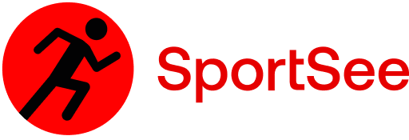

  

# Getting Started with Vite

This repo contains all the source code to run the micro API for the sports analytics dashboard SportSee.

### Technologies / Library

- JS
- HTML5
- CSS3

- React
- Recharts

### 2.1 Prerequisites

- [NodeJS (**version 20.20.0**)](https://nodejs.org/en/)
- [Yarn](https://yarnpkg.com/)

If you are working with several versions of NodeJS, we recommend you install [nvm](https://github.com/nvm-sh/nvm). This tool will allow you to easily manage your NodeJS versions.

### 2.2 Launching the project

A/ Front
- Fork the repository. 
- The `yarn start` command will allow you to run the React project.

C/ Back
- GFork the repository git : https://github.com/KsoniaK/SportSee-Back.git 
- The `yarn dev` command will allow you to run the micro API.

## 3. Endpoints

### 3.1 Possible endpoints

This project includes four endpoints that you will be able to use: 

- `http://localhost:3000/user/${userId}` - retrieves information from a user. This first endpoint includes the user id, user information (first name, last name and age), the current day's score (todayScore) and key data (calorie, macronutrient, etc.).
- `http://localhost:3000/user/${userId}/activity` - retrieves a user's activity day by day with kilograms and calories.
- `http://localhost:3000/user/${userId}/average-sessions` - retrieves the average sessions of a user per day. The week starts on Monday.
- `http://localhost:3000/user/${userId}/performance` - retrieves a user's performance (energy, endurance, etc.).

**Warning, currently only two users have been mocked. They have userId 12 and 18 respectively.**

### 3.2 Examples of queries

- `http://localhost:3000/user/12/performance` - Retrieves the performance of the user with id 12
- `http://localhost:3000/user/18` - Retrieves user 18's main information.